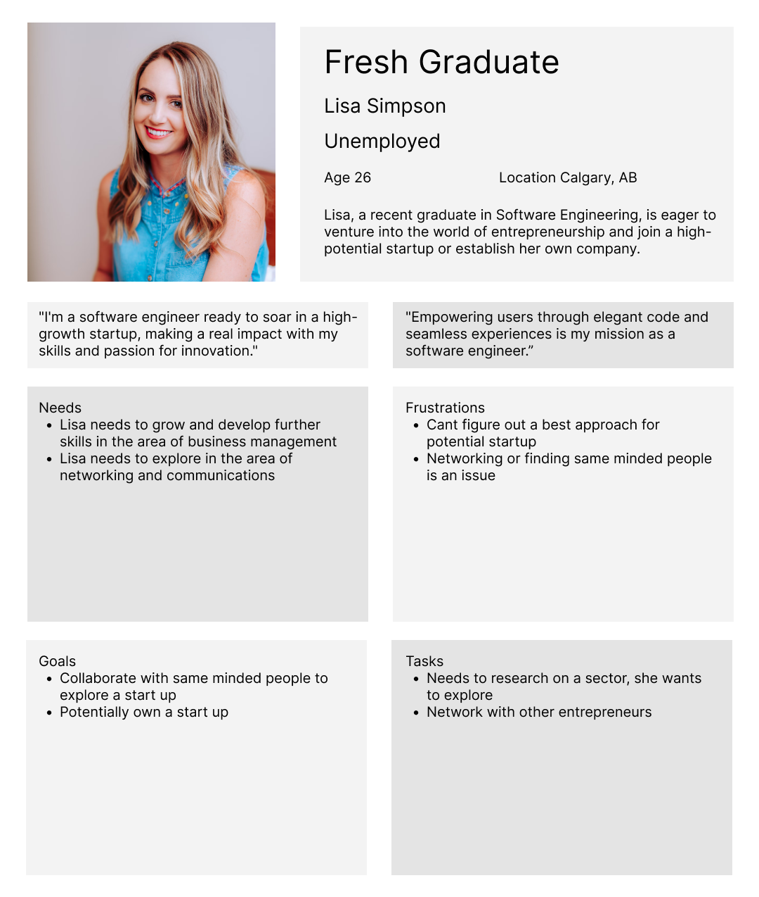

    

 
  

    

 

    <a href="#">Final Product</a>

 
  

    

 

  The objective is to develop a detailed and comprehensive fake persona. This persona will serve as a valuable tool to highlight and understand the individual’s specific needs, frustrations, goals, and tasks.

  

  

 
 

    

<h3 align="center">🚀 Development Tools & Environments</h3>

    
    

<h2></h2>

<h3 align="center">⚡ Databases</h3>

  

<h2></h2>

<h3 align="center">🌐 Web Servers</h3>

  
  

<h2></h2>

<h3 align="center">⚙️ Hardware and Microcontroller Boards</h3>

  

